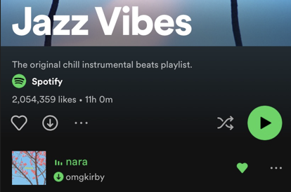

# Session 1: Sprint 3

**Author(s):** @jakestandley#0001

**Sprint Period:** May 17th, 2022 - May 30th, 2022

**Next Sprint Ends:** June 27th, 2022

## Quick Links 

| [omgkirbydao Twitch](https://www.twitch.tv/omgkirbydao) | [omgkirbydao Twitter](https://twitter.com/omgkirbyDAO) | [omgkirbydao Discord](http://discord.com/invite/omgkirby) | [Download omgkirby NFT mp4/stems/wav](https://www.notables.co/gallery/omgkirby) |
| ------------------------------------------------------- | ------------------------------------------------------ | --------------------------------------------------------- | ------------------------------------------------------------------------------- |

## Overview 

Session 1: Sprint 3 brought our first Session in a full circle with the minting of our PFP project we announced during [session-1-sprint-1.md](session-1-sprint-1.md "mention")! We launched 3000 PFPs [**that are reserved from omgkirbyDAO Genesis holders until June 30th**](https://www.notables.co/gallery/omgkirby), after which they are granted to the DAO Treasury. In addition, we launched **2000 PFPs that were available for public minting.**

Originally, we announced the PFP mint coming in late May, with a .1ETH asking price. But as market conditions changed, especially around ETH, and as we saw other free mints work successfully, we decided to pivot on our strategy. We removed the price tag from our mint, and instead reexamined what the goal of the mint was - growing the engaged community within the DAO.

We launched the 'kirbylist' initiative about a week and a half prior to the mint - asking the public & some key partner projects to provide a quick blurb about _why_ they wanted to be a part of the omgkirbyDAO via a Premint form. We then spent almost 48 hours (shoutout @Aurelian#7564) finding the best answers and scrubbing out as many botted responses as we could (and there were a ton). If someone 'won' the kirbylist spot, they were told via the Premint link they signed up with or email. The kirbylist was given 2 hours pre-public mint to pick up their omgkirby PFPs.

The end result? A successful free PFP mint with over 1000 of the public mint PFPs going to the individuals selected by the kirbylist process! We're extremely proud of how the mint went overall - and excited to welcome all of the new members to the DAO over the coming weeks that make up Pre-Session 2.

And if you're a genesis holder, but you haven't claimed your free PFP(s) yet, make sure you do ASAP! Moving forward in July, these will become our primary token for voting on DAO proposals and participating in governance. But have no fear, those [genesis NFTs](https://www.notables.co/gallery/omgkirby-genesis) still have plenty of value for future generative omgkirbyDAO drops...



As noted in the diagram above:

* Holding _just_ a PFP will grant you WL access for future omgkirbyDAO generative drops
* Holding _just_ a Genesis will grant you a discounted mint price on future omgkirbyDAO generative drops, but only during public mint
* Holding _both_ a PFP & a Genesis will grant you both WL access and a discounted mint price on future omgkirbyDAO generative drops

In addition - we want to create some VIP experiences around future drops for those holding both, so stay tuned for more information from the team on that front in the coming weeks! But the PFP isn't the only project we've all been working on.

### End of Session 1

Session 1 officially came to a close last Monday on May 30th, 2022 - and with it - our first round of [Working Groups](../governance/working-groups.md). As a reminder, we had five Working Groups, [voted on by priority](https://snapshot.org/#/omgkirby.eth/proposal/0xc5d534bc5a33eb7d8a4aab73c60283212e55af2b9f935775b098bf781880dfca), by the community. Our Working Groups were:

* ****[**Complex voting system established**](https://snapshot.org/#/omgkirby.eth/proposal/0x850d67f2a33766bcb51b5ff1efd24ba5492a65d61879088d8d55991d32bff43c)
* ****[**Treasury Management**](https://snapshot.org/#/omgkirby.eth/proposal/0xc1b2c368d9b0a1743d4d7530d8cb2d9b3408bc8db85d53f2eaea9f5f72b44f65)****
* ****[**Organize Marketing Effort**](https://snapshot.org/#/omgkirby.eth/proposal/0x6ac2113a9b5a3916814efb02f6317e4399706939cc341df98f4d62df035592fd)****
* ****[**omgkirby creates a track with high-visibility artist feature**](https://snapshot.org/#/omgkirby.eth/proposal/0xe4dbf47ab59bcd48b7d28b7b73da17378369400829f9b81f98a3d8f76bb667ba)
* [**omgkirbyDAO Album**](https://snapshot.org/#/omgkirby.eth/proposal/0xc774c5ec7271cac38a48acfdd186c0f59bdf7fe37e9401acecf2747f675ad6de) ****&#x20;

We certainly learned a lot about how Working Groups can work/fail during Session 1, which we've been noting in the past sprint recaps, and will cover in more depth down in this editions[#post-mortem](session-1-sprint-3.md#post-mortem "mention") section.&#x20;

Overall though, I would call our first round a success & I'm very proud of our Community Members who stepped up and helped with the process - we're working to get them a POAP for their help so we can start recognizing the contributing members of the community!

We're going to continue to leverage POAPs or something similar moving forward so we can work towards building a loose 'soul-bound' NFT resume within the DAO - something I'm very excited about!

### kitsune EP

Another awesome surprise from the omgkirby team this week was the surprise release of a **DAO-owned EP** entirely produced by omgkirby - _kitsune. kitsune_ is an incredible work from kirby, and I'm excited for everyone to listen - each song flows perfectly into the next.

The other awesome piece here is the DAO ownership! 100% of the royalties from this work will flow into the DAO Treasury, and serves as a real asset we can point at as driving revenue.



But maybe the _most exciting_ part of this announcement is our playlist placement. As of right now, _nara_ the final track of the EP has landed on Jazz Vibes on Spotify, one of the biggest lo-fi playlists on the platform - with over 2mm listeners.

Make sure to go [give the playlist a listen](https://open.spotify.com/playlist/37i9dQZF1DX0SM0LYsmbMT?si=8e80f85406154811) as well if you get a chance!

### Community Highlights

1. I want to give a HUGE shoutout to @Pierce#2237 for his creation of a space in CryptoVoxels for our PFP Mint party last week. It was awesome to see them approach this with their own initiative and absolutely crush it. [Come check out the space!](https://www.cryptovoxels.com/play?coords=S@758W,4S)
2. I want to give a big thanks to @bab#1183 & @FirstAidAde#9301 for contributing designs for our Working Group Session 1 POAPs - they both came out great!

### Session 2 Intro

Okay, so _finally_ I want to give a quick overview of the logistics for Session 2 - and hopefully for each subsequent Session to follow.

Session 2 will run 12 weeks, in two separate blocks.&#x20;

* Pre-Session: May 30th - June 27th
* Session 2: June 27th - August 22nd

The goal of the Pre Session is to peform this [#post-mortem](session-1-sprint-3.md#post-mortem "mention") of Session 1, give all of the WG members a brief break, and take time to receive [Community Proposals](https://airtable.com/shrK27CfJVvkXHOc6). Towards the end of this Pre-Session, around June 20th, we will put all of the community temperature-checked proposals up for a Snapshot vote - and those that win will be granted their funding for the 8 week period that makes up Session 2.

Similar to Session 1, Session 2 will be broken up into four sprints - Sprint 0 -> 4. The goal of Sprint 0 is to recruit your Working Group Team, and the remaining three sprints are for accomplishing the goal.

I think this Session structure will continue to provide some good guidance for the DAO and ensure we're taking on bite-sized challenges that can be easily measured and delivered on.

## Proposals 

Our proposals for the end of Session 1 hint at what's to come in Session 2... more Working Groups! And ones that have the potential to be turned into a 'Core Group', such as Operations. Our Community team is the heart of our current Operations - so the proposal to fund this group for the entire 12 week period, rather than the 8 week period that the other Groups will be funded for, is a decision to bet on the longevity of the DAO.

Depending on how other groups grow & expand during this Session, I expect to see two or three more 'Core Groups' come August!

* [Session 2 Operations Budget Proposal](https://snapshot.org/#/omgkirby.eth/proposal/0xdf8cb31b233f0ad1b8fc80fe04d02ca33ee5add88995a057c63b2260c8b8515e)
  * 36 For (100%)
  * 0 Against (0%)
  * 0 Abstain (0%)

## DAO Treasury update 

Multisig Wallet Address: [ 0x7291cc605653a9FCfbceD63313156E654eAF259b](https://etherscan.io/address/0x7291cc605653a9fcfbced63313156e654eaf259b).

|     Description    | Amount (ETH) | Notes                                      |
| :----------------: | :----------: | ------------------------------------------ |
|   Start Treasury   |     95.26    |                                            |
|                    |              |                                            |
| Operating Expenses |    (10.64)   | Community Manager, Mod, DAO Consultants    |
| Marketing Expenses |    (1.27)    | Social Media Contests - NFTs for giveaways |
| DAO Album Expenses |    (0.36)    | omgkirby Performance Mask                  |
|                    |              |                                            |
|   Final Treasury   |     82.98    |                                            |

[You view the full breakdown in google sheets here!](https://docs.google.com/spreadsheets/d/1Ni7h7dwPDm8aDnXdahNSne8TEjLRrZhXmUVXdLcsFUo/edit?usp=sharing)

This sprint's expenses were primarily our Operating Expenses - the cost of the DAO consultants approved in [one of the DAO's first snapshot votes](https://snapshot.org/#/omgkirby.eth/proposal/0xa3fa1fd9323e0a2c317354d987e154d00e4ccd26b5a729426fd79adfb1b333cd). This was the first third of the payment made - with two outstanding. This payment was for the delivery of the Lite Paper, which will be published on June 10th, after the DAO's first principles are ratified (vote to go live EOD June 3rd).&#x20;

In addition, the DAO spent some funds on social media marketing the PFP drop - including the purchase of a handful of NFTs from Dippies, alien frens & Loser Club to use in social media giveaways.

Finally, the bill for the [omgkirby Performance Mask](https://snapshot.org/#/omgkirby.eth/proposal/0x4c00ec1d08d29cb72e815f3d4f15d5a5062d4a5155aee133a00306a5df2a8d7c) also came in - lower than expected, which is awesome!

Make sure to check out the full breakdown for all of the metadata! Also check out the [#post-mortem](session-1-sprint-3.md#post-mortem "mention") for each Working Group below for each groups full budget breakdown during Session 1.

## Post Mortem 

**Note:** Organized by [Working Group](../governance/working-groups.md). Check out the [Session 1: Sprint 3 budget breakdown](https://docs.google.com/spreadsheets/d/1Ni7h7dwPDm8aDnXdahNSne8TEjLRrZhXmUVXdLcsFUo/edit?usp=sharing) for a full Session breakdown of each WG's budget.

[**Complex voting system established**](https://snapshot.org/#/omgkirby.eth/proposal/0x850d67f2a33766bcb51b5ff1efd24ba5492a65d61879088d8d55991d32bff43c) **by @lemondropkid#3159**

* _Budget_

| Approved Budget (ETH) | Actual Spend (ETH) | Expected Spend (ETH) | Total Spend (ETH) | Budget Favorability (ETH) |
| :-------------------: | :----------------: | :------------------: | :---------------: | :-----------------------: |
|          1.25         |          0         |         1.25         |        1.25       |             0             |

* _Deliverable?_
  * Completed a survey and research project on governance models used by other popular DAOs. Members of the WG reached out to DAOs they were members of or were interested in, conducted an extensive survey, and then summarized their findings in the deck below!



* _What worked best in organizing your committee around delivering this initiative?_
  * Our working group consisted of 6 members and a WG lead. Relying upon asynchronous ways for us to work was very critical. We leveraged Airtable for a Kanban project management system Google Slides for our deliverable, and Discord for communication. This allowed us to work on our own schedules but stay on the same timeline. It was definitely critical for us to have calls for anyone who could attend (recorded for those unable to) that allowed us to iron out any questions, align on process/goal, and generally make our action items more approachable.
* _What would you do differently if given the opportunity to redo this initiative?_
  * We had to adjust the scope of our project due to falling behind schedule. This was solely on me as the WG leader. My day job absorbed bandwidth that was intended for the WG project. This taught me a few key things about how we can more successfully execute the WG structure moving forward.
    * **Reduce Single Points of Failure:**&#x20;
      * We should encourage proposals for working groups to include at least two leads. This redundancy allows us to make sure that if one person is pulled away from the WG for any reason, there is someone else available that understands the goal and can help drive. The key of getting this right moving forward will make sure that accountability doesn’t drop as multiple people are designated in charge of deliverables. Reduce Single Points of Failure We should encourage proposals for working groups to include at least two leads. This redundancy allows us to make sure that if one person is pulled away from the WG for any reason, there is someone else available that understands the goal and can help drive. The key of getting this right moving forward will make sure that accountability doesn’t drop as multiple people are designated in charge of deliverables.
    * **Socialize the Vision/Goal as early as possible:**&#x20;
      * Part of our issues were caused by the fact that I had drafted the proposal on my own. This meant that it was clearest to me what our goal was, and I needed to do a better job of relaying that to the team as early as possible so they felt empowered to run with the project during my absence.&#x20;
      * We could see a really motivated / empowered WG form if during the draft proposal discussion people also apply for the team. The idea being that individuals who help shape the proposal will have a higher sense of clarity around the vision/method to get there and will have more buy-in as contributors during the drafting process.
    * **Funding Working Groups in Phases:**
      * We had a low budget proposal and were able to contribute a meaningful governance recommendation within Season 1, however I can imagine a situation where a WG with a large budget is unable to deliver for whatever reason. We should consider designing some oversight on the progress of WGs as way to make sure that budgets are only unlocked as progress continues to avoid wasting DAO resources.
* _How has this initiative opened up new opportunities for the community to fulfill its vision?_
  * This initiative is the first iteration of increasing the flexibility of our voting system to ensure that we have open and democratic processes in place that ensure we use resources according to the community’s preference.
  * Finally, we’ve included suggestions on further analysis that the next governance WG can use as jumping off points if they find our recommendations for voting structure is not satisfactory to put to a vote.

****[**Treasury Management**](https://snapshot.org/#/omgkirby.eth/proposal/0xc1b2c368d9b0a1743d4d7530d8cb2d9b3408bc8db85d53f2eaea9f5f72b44f65) **by @jakestandley#0001**

*   _Budget_

    | Approved Budget (ETH) | Actual Spend (ETH) | Expected Spend (ETH) | Total Spend (ETH) | Budget Favorability (ETH) |
    | :-------------------: | :----------------: | :------------------: | :---------------: | :-----------------------: |
    |          1.28         |          0         |         1.28         |        1.28       |             0             |
* _Deliverables?_
  * Set up our [multisig wallet](https://etherscan.io/address/0x7291cc605653a9FCfbceD63313156E654eAF259b) via [Gnosis](https://gnosis-safe.io/)
  * Set up expense reporting with [Utopia Labs](https://www.utopialabs.com/)
  * Created a basic [dune dashboard](https://dune.com/jakestandley/omgkirbyDAO-Treasury), and a more complex PowerBI Dashboard
  * Created the [treasury-info.md](../governance/treasury-info.md "mention") page


a PowerBI dashboard created with free API calls from https://etherscan.io


We are publishing bi-weekly Treasury updates in the **Sprint Recap**

* _What worked best in organizing your committee around delivering this initiative?_
  * The Treasury WG did an excellent job in rallying and finding best practices used by other DAOs. I asked each member to spend some time understanding how DAOs they were a part of were going about Treasury Management and we arrived at: Utopia Labs for expense reporting & Dune.xyz dashboards for treasury tracking.
  * The issue here at the moment is that - Dune.xyz doesn't speak to the custom metadata we are creating in Utopia Labs, and that's where PowerBI became the most viable option. I have used PowerBI in the past, and the PowerQuery features made tying the below datasets together very straightforward.
    * historical etherscan data
    * Utopia Labs Data
    * Approved Snapshot Vote Spends
* _What would you do differently if given the opportunity to redo this initiative?_
  * **Delegation**
    * I think first and foremost, as a WG Leader, I need to work more on delegation early on. I think we had everyone sort of running around blindly performing similar tasks, and this ultimately didn't make a ton of sense. If I had better organized into separate tasks from the jump, we might have been more productive, had more opportunities for individuals to participate and seen increased output.
  * **Technical Requirements**
    * Treasury Management is ultimately a hyper technical topic. While it's important for the WG to be transparent and accessible - better reviewing everyone's technical expertise or recruiting someone with more formal expertise in DAO Treasuries might have been beneficial. I have technical experience in data engineering & Business Intelligence that I was able to leverage to build these dashboards, but there were plenty of topics we wanted to discuss that we didn't get to.
    * One of these is Treasury Diversification. We got as far as discussing bond strategies as potential ways to diversify our holdings, but ultimately we lack the on-the-job-experience to make the call & feel confident in it.
* _How has this initiative opened up new opportunities for the community to fulfill its vision?_
  * At the start of this Session, we had the wallet the original Genesis drop was deployed from as our sole Treasury. The wallet was operated by the Notables team - who were responsible with it - but it was still a high risk having a single person as the point of failure for payments getting sent out, verifying expenses, etc.
  * We now have a multisig wallet, comprehensive expense reporting and tracking, and a transparent treasury dashboard that requires 0 technical experience to look at and understand.
  * Hopefully this empowers more community members to feel confident in submitting Community Proposals for Session 2 and onwards - with responsible budgets and the aim of replenishing our Treasury!

[**Organize Marketing Effort**](https://snapshot.org/#/omgkirby.eth/proposal/0x6ac2113a9b5a3916814efb02f6317e4399706939cc341df98f4d62df035592fd) **by @Aurelian#7564**

*   _Budget_

    | Approved Budget (ETH) | Actual Spend (ETH) | Expected Spend (ETH) | Total Spend (ETH) | Budget Favorability (ETH) |
    | :-------------------: | :----------------: | :------------------: | :---------------: | :-----------------------: |
    |          10.5         |        5.25        |           3          |        8.25       |            2.25           |
* _Deliverables?_&#x20;
  * Increased omgkirbyDAO's twitter presence significantly - with a 2000%+ increase on impressions alone in the last month
  * Created a Monday/Friday cadence for omgkirbyDAO hosted Twitter Spaces

.png>)

* _What worked best in organizing your committee around delivering this initiative?_
  * Discord to find motivated individuals&#x20;
  * Plugging those individuals into working groups and solo tasks to help out the DAO&#x20;
  * Connecting motivated individuals to our various channels of outreach&#x20;
    * Twitter team&#x20;
    * Cryptovoxels&#x20;
    * Telegram Teams
* _What would you do differently if given the opportunity to redo this initiative?_
  * Streamline the process for voting&#x20;
  * Make it easier access&#x20;
  * Streamline the collaboration process&#x20;
    * Make it easier for artists to do collabs with us&#x20;
    * Make it easier for artists to sign onto omgkirby as a dao sponsored artist&#x20;
  * Make the PFP Free earlier on&#x20;
  * Have the Sakura event running up on the 2 weeks before the mint
* _How has this initiative opened up new opportunities for the community to fulfill its vision?_
  * We have met a lot of greater leaders and dedicated individuals in this space&#x20;
  * To that end we hope to play a role in the formation of a Web3 Music Industry working WITH other spaces and projects&#x20;
    * Together we have a real chance to make a difference for artists and the communities that support them

****[**omgkirby creates a track with high-visibility artist feature**](https://snapshot.org/#/omgkirby.eth/proposal/0xe4dbf47ab59bcd48b7d28b7b73da17378369400829f9b81f98a3d8f76bb667ba) **by @jakestandley#0001**

* _Budget_

| Approved Budget (ETH) | Actual Spend (ETH) | Expected Spend (ETH) | Total Spend (ETH) | Budget Favorability (ETH) |
| :-------------------: | :----------------: | :------------------: | :---------------: | :-----------------------: |
|          0.25         |          0         |           0          |         0         |            0.25           |

* _Deliverables?_
  * All I can say here is... stay tuned for more information ASAP - but we absolutely accomplished creating a track with a high-visibility artist :smile:
* _What worked best in organizing your committee around delivering this initiative?_
  * This was handled entirely by the Core omgkirby team this time.
* _What would you do differently if given the opportunity to redo this initiative?_
  * I think there's still more opportunity to involve the community here in some fashion. The main bottleneck with on this initiative revolved around working with another artist's team, and the legal protections they typically look for when collaborating. At the moment, DAOs are a foreign concept to artists, and the idea of working with a 'headless' artist might prevent some prolific artists from working with us.
* _How has this initiative opened up new opportunities for the community to fulfill its vision?_
  * This upcoming collaboration will hopefully bring positive press to our project, continue to cement omgkirbyDAO as one of the most original projects in the web3 music space, and replenish our Treasury for use in more Community Proposals.

[**omgkirbyDAO Album**](https://snapshot.org/#/omgkirby.eth/proposal/0xc774c5ec7271cac38a48acfdd186c0f59bdf7fe37e9401acecf2747f675ad6de) **by @kryptokid#6525**

* _Budget_

| Approved Budget (ETH) | Actual Spend (ETH) | Expected Spend (ETH) | Total Spend (ETH) | Budget Favorability (ETH) |
| :-------------------: | :----------------: | :------------------: | :---------------: | :-----------------------: |
|         26.25         |        0.98        |           0          |        0.98       |           25.27           |

* _Deliverables?_
  * Created instrumental using community-sourced samples -> received song submissions from community members on the instrumental -> voted on the DAOs favorite submission -> released the track on DSPs and did a [free airdrop!](../nft-releases/dont-let-me-down-airdrop.md)



* _What was accomplished this sprint_
  * The current DAO structure and overall team organization made this very easy to begin forming Working Groups of interested individuals and set Spring goals. Discord and our Twitter DM group ended up being the easiest ways to community and relay information.
* _Did you achieve or fall behind your proposed goals - why?_
  * This specific initiative needs much longer timelines. The process of finding artists interested in web3, creating the music, and curating the music is much more involved and takes much longer than we had initially predicted.
* _How will next sprint be different?_
  * The OMG Kirby album has already brought together creatives and artists that are excited about web3 together in new ways and taken the OMG Kirby name to new groups. We feel that upon execution of the OMG Kirby album, we will reach and wide net of people interested in music and web3.

Based on the feedback above I have a few key takeaways:

1. **Need to structure Working Groups a little differently** moving forward. We need to remove the single point of failure in having one Leader for each group. In addition, we need to better provide those leaders tools to delegate and recognize members who go above & beyond the ask. Right now it's up to each individual leader to create their structure, and there is no incentive to participate besides passion, a POAP & potential payment in ETH.
2. **Need to better forecast budgets**, we don't have any teams going over budget - but it also feels like some of the proposals earmarked far too large of amounts for the length of time the WG was going to exist. When we earmark this info, we also note that as an Outstanding Expense in our [Treasury Reporting dashboard](https://app.powerbi.com/view?pageName=ReportSection\&r=eyJrIjoiYzgxMDUxYmEtYjMzOS00YmMyLTlmMGQtOWRkNzBiYWM1ZDU5IiwidCI6IjhkYTQ3YTBjLTEwNzUtNGNkNy1hNWRiLTAyYTEzNDI0MmIzZSIsImMiOjF9), aka money that can't be touched. This makes us potentially illiquid if something was to happen to the market - or we needed funds quick for another time-sensitive project.

## Next Steps 

1. **Onboard new DAO members** via the PFP that has now launched. Make sure our onboarding funnel is up to par, and make improvements where needed.
2. **Launch Community Proposal Form** and begin to implement the process to get Community Proposals from ideation to votes.
3. **Continue to promote our PFP project**, especially as we work towards our next generative collaboration with a prolific artist.

## Helpful Resources 

1. [Are DAOs the Future of Agile Organizations?](https://www.scrum.org/resources/blog/are-daos-future-agile-organizations)
2. [Describing Major Music NFT Platforms as Music Products — Part 2: Royal.io](https://musicdatapro.medium.com/describing-major-music-nft-platforms-as-music-products-part-2-royal-io-35f2d09cd2ff)
3. [The difference between audience & community](https://musicx.substack.com/p/-the-difference-between-audience?r=4s69p\&utm\_medium=ios\&s=r)
4. [How NFTs Are Shaping the Way Music Sounds](https://pitchfork.com/features/article/how-nfts-are-shaping-the-way-music-sounds/)

## Conclusion 

WOW - that was a lot of words. Congrats to anyone who made it to this conclusion, I am going to keep it brief!

TLDR - the DAO has successfully pulled off it's first Session, culminating in our PFP drop - the new key to our community. The Working Groups accomplished some awesome things, and it appears there's another generative drop on our horizon as we head into Session 2. Excited to see how the community continues to pull together as we grow!

Make sure you stay tuned to our Discord & twitter for more information. As always reach out to me (**@jakestandley#0001**) if you're ever looking to get more involved in the community!🌸&#x20;
